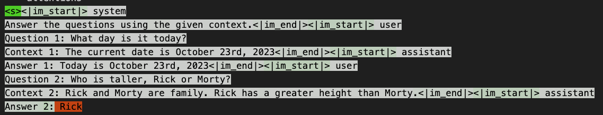

# Prompt analysis

Various methods of prompt engineering using empirical measurements.

## [attention.ipynb](./attention.ipynb)

Use the attention outputs of the first attention layer to get relevance
scores for each input token relative to each output token.

This should allow intelligent prompt tweaking by determining which tokens
in the prompt actually affect the output.

### Questions

#### Question 1

> Why is there a `1` layer dimension in the attention layer output dimensions `heads, 1, inputs, inputs`?

Maybe just so it is a column vector?

#### Question 2

> Is the attention output of the first attention layer really
> all we need?

Not sure. Intuitively, since AFAIK an attention layer is followed
by a fully connected layer, all outputs after that first
fully connected layer cannot be attributed to a single input
token.

### Notes

#### Average attention

Each forward pass calculates the attention from each token to all previous tokens. When calculating
the attention of each token in the final visualization it is important to account for that. For a prompt
of length `n`, the first token total attention needs to be divided by `n`, and the last token needs to
be divided by `1`.

This is true, but we are only starting to keep track of attention **after** the input prompt. To calculate
the average attention in a prompt, each attention needs to be divided by the total number of **generated**
tokens. If we want keep track of the attention to generated tokens as well, then we need to divide each
one by the respective value in the series `g-1, ..., 1`, where `g` is the amount of generated tokens. We
start from `g-1` because each generated tokens only gets attention from the next tokens. The last generated
token gets no attention, the second to last one, ..., the first generated one gets attention from all next
generated ones ergo `g-1`.

#### Weird attention

The attention seems to be completely irrelevant to the model output? For example:

The output is correct, which makes me think that the model did pay attention to it, but unless I got
something wrong in the calculations, almost no attention is actually paid to the context? Maybe this
is because [Mistral](https://mistral.ai/news/announcing-mistral-7b/) uses sliding window attention
we see that?
